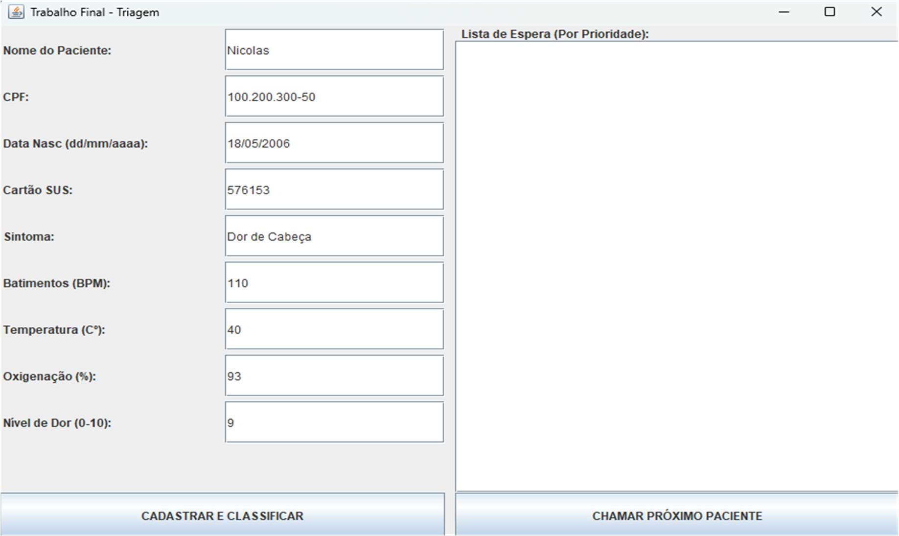
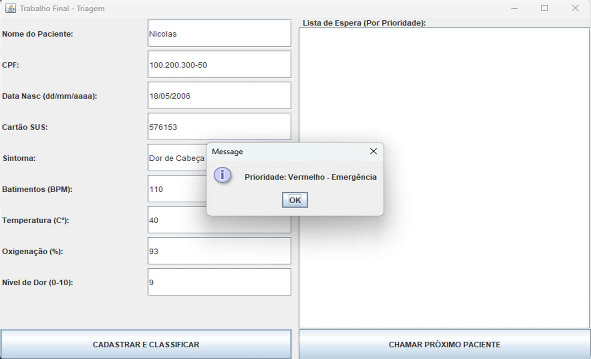
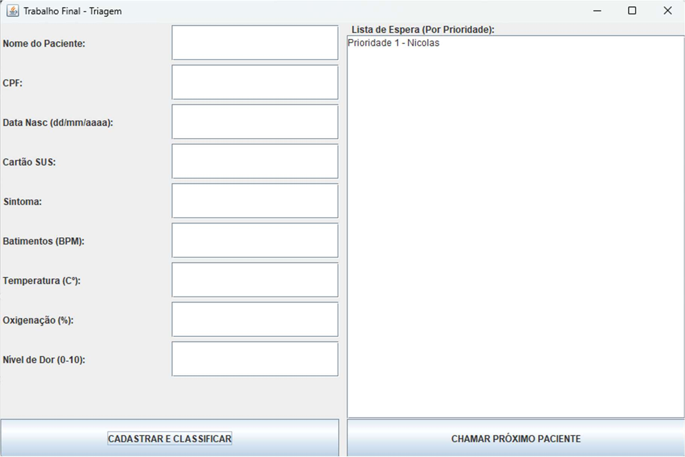
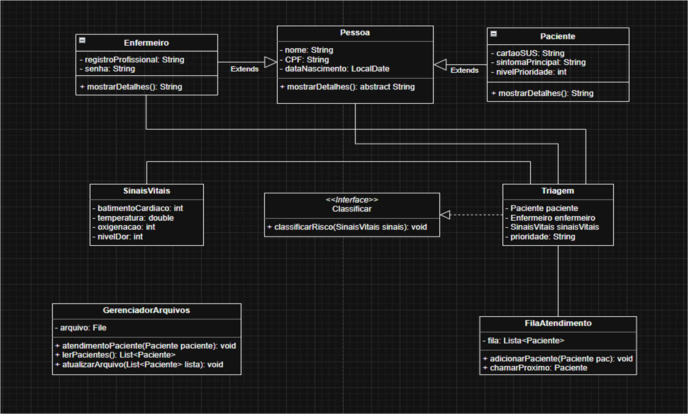
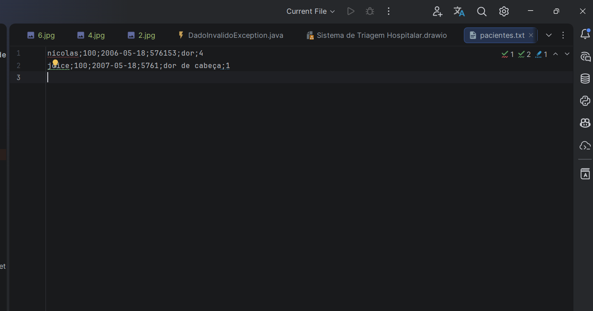
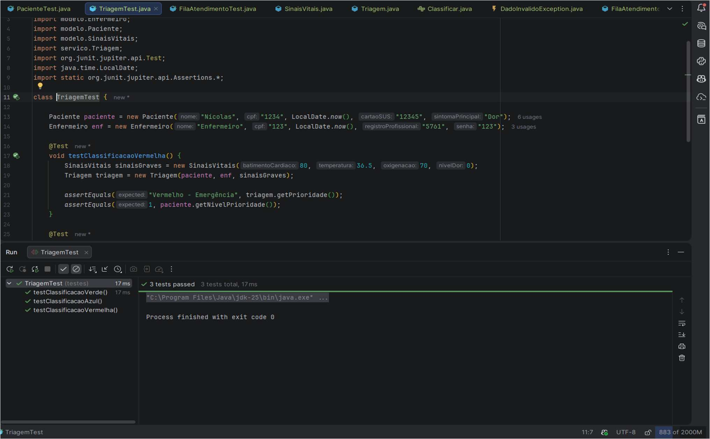

# Sistema de Triagem Hospitalar

> **Alternar idioma**: [English version](README.md) • [Português](README_pt.md)

<div style="display: inline-block; margin-bottom: 15px;">
  
  
  
  
  
</div>

## 📋 Sumário

- [Visão Geral](#visão-geral)
- [Arquitetura](#arquitetura)
- [Tecnologias](#tecnologias)
- [Estrutura](#estrutura)
- [Funcionalidades](#funcionalidades)
- [Regras de Triagem](#regras-de-triagem)
- [Capturas de Tela](#capturas-de-tela)
- [Configuração](#configuração)
- [Execução](#execução)
- [Testes](#testes)
- [Persistência de Dados](#persistência-de-dados)
- [Melhorias Futuras](#melhorias-futuras)
- [Autor](#autor)

---

## 🎯 Visão geral

O Sistema de Triagem Hospitalar é um simulador desktop de triagem de emergência com Java e Swing. O objetivo é processar dados de pacientes, validar sinais vitais, classificar prioridades e controlar uma fila de atendimento por gravidade.

---

## 🏗️ Arquitetura

Padrão MVC:

- **Modelo**: `Pessoa`, `Paciente`, `Enfermeiro`, `SinaisVitais`
- **Serviço**: `Classificar`, `Triagem`, `FilaAtendimento`
- **Visão**: `TelaPrincipal` Swing
- **Dados**: `GerenciadorArquivos`

Fluxo:
1. Cadastro de paciente
2. Validação e classificação
3. Ordenação na fila
4. Persistência em `pacientes.txt`

---

## 🛠️ Tecnologias

- Java 17+
- Swing
- JUnit 5
- Maven

---

## 📁 Estrutura do projeto

```
src/
  dados/
    GerenciadorArquivos.java
  excecoes/
    DadoInvalidoException.java
  modelo/
    Pessoa.java
    Paciente.java
    Enfermeiro.java
    SinaisVitais.java
  servico/
    Classificar.java
    Triagem.java
    FilaAtendimento.java
  visao/
    TelaPrincipal.java
  testes/
    TriagemTest.java
    FilaAtendimentoTest.java
    PacienteTest.java
pacientes.txt
README.md
README_pt.md
assets/
  0.jpg
  1.jpg
  2.jpg
  3.jpg
  5.png
  6.jpg
```

---

## ✅ Funcionalidades

- Cadastro de paciente (nome, CPF, SUS, sintomas, sinais vitais)
- Validação em `SinaisVitais`
- Classificação automática em `Triagem`
- Fila de prioridade em `FilaAtendimento`
- Interface Swing com feedback e botões

---

## 🚦 Regras de Triagem

- Vermelho (1): emergência
- Laranja (2): alto
- Amarelo (3): moderado
- Verde (4): baixo
- Azul (5): mínimo

Critérios:
- batimentos
- temperatura
- oxigenação
- dor

---

## 🧩 Capturas de Tela

### Cadastro e entrada de dados


### Resultado da classificação


### Fila de espera


### Diagrama UML


### Persistência de dados


### Evidência de testes


---

## ⚙️ Configuração

Requisitos:
- Java 17+
- Maven 3.8+

Instalação:
```
git clone https://github.com/YOUR_USERNAME/YOUR_REPO.git
cd "Sistema de Triagem Hospitalar"
mvn clean install
```

---

## ▶️ Execução

```
mvn exec:java -Dexec.mainClass="visao.TelaPrincipal"
```

---

## 🧪 Testes

```
mvn test
```

---

## 💾 Persistência de Dados

Formato `pacientes.txt`:
`nome;cpf;sus;batimentos;temperatura;oxigenacao;dor;cor;prioridade`

Exemplo:
`João.;11111111111;8888888888;110;38.2;92;4;Laranja;2`

---

## 🚀 Melhorias Futuras

- UI em JavaFX ou web
- Persistência em banco (SQLite/PostgreSQL)
- Autenticação
- API REST

---

## 👨‍💻 Autor

**Nícolas Harnisch**

- GitHub: https://github.com/NicolasHarnisch
- LinkedIn: https://linkedin.com/in/nicolasharnisch
- Email: nicolasgomeshar@gmail.com
